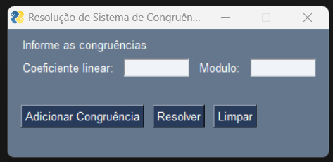
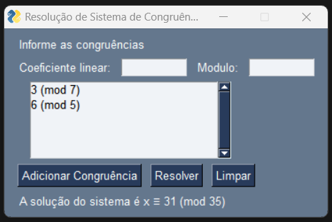

# Resolução de Sistema de Congruências
Bem-vindo ao projeto "Resolução de Sistema de Congruências", Este é um programa em Python que utiliza o Teorema Chinês do Resto para resolver sistemas de congruências lineares. 

# Instalações Necessárias
Certifique-se de ter as seguintes bibliotecas Python instaladas antes de executar o programa:
- PySimpleGUI: Para uso de interface.
- pyinstaller: Para compilação em executavel .exe 

# Comandos de Instalação das Bibliotecas

Para instalar as bibliotecas necessárias, utilize os seguintes comandos:
1. **PySimpleGUI:**
   ```bash
   pip install PySimpleGUI
2. **pyinstaller**
   ```bash
   pip install pyinstaller
3. **Compilar**
   ```bash
   pyinstaller --onefile nome_do_arquivo.py

# Instruções de Uso

1. **Execução do Script Python:**
   - Execute o script Python.
   - Uma janela será aberta solicitando que você informe as congruências.

2. **Informe as Congruências:**
   - Insira o coeficiente linear (a) e o módulo (m) nas caixas de texto.
   - Clique em "Adicionar Congruência" para incluir a congruência na lista.
   - Você pode adicionar várias congruências, e elas serão exibidas em uma lista.

3. **Resolver o Sistema:**
   - Clique em "Resolver" para calcular a solução do sistema de congruências.
   - O resultado será exibido na parte inferior da janela.

4. **Limpar Dados:**
   - Clique em "Limpar" para reiniciar e limpar todas as congruências.
   - A lista de congruências será ocultada, e o resultado será apagado.

# Imagens de Demonstração

<p float="left">
  
  
</p>


# Observações
Certifique-se de digitar apenas números inteiros para os coeficientes lineares (a) e módulos (m).
Se ocorrer um erro, uma mensagem de erro será exibida na tela.

Por motivos de tamanho de arquivo não pude adicionar o main.py compilado em formato executavel .exe no repositorio do git

# Contribuições
Se você quiser contribuir para este projeto, sinta-se à vontade para enviar um pull request. Ficamos felizes com sugestões e melhorias!

## 👨‍💻 Desenvolvedor

Este projeto foi desenvolvido por **Alex Pablo de Oliveira Moraes**. 

Sou estudante de **Sistemas de Informação** na **UNEMAT**, apaixonado por tecnologia, programação e segurança de redes e tecnologias relacionadas ao desenvolvimento backend e segurança da informação.

Você pode me encontrar nas redes sociais ou conferir meus outros projetos no meu perfil [GitHub](https://github.com/AlexPablo-hub).

Se tiver alguma dúvida ou sugestão sobre o projeto, fique à vontade para entrar em contato!
